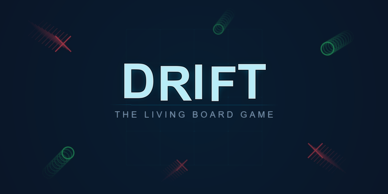

# DRIFT — The Living Board Game

An evolution of Tic-Tac-Toe where the board is alive.

**Place. Push. Decay. Anchor.**



## What is DRIFT?

DRIFT takes the classic game of Tic-Tac-Toe and breathes life into it. The board is no longer static — pieces slide, age, and eventually vanish. Every move creates ripples across the entire board. No two games are ever the same.

- **Board:** 4×4 grid
- **Players:** 2 (X vs O)
- **Win:** Get 4 in a row (horizontal, vertical, or diagonal)

## Core Mechanics

| Mechanic | Description |
|----------|-------------|
| **Place** | Put your mark on any empty cell |
| **Push** | Slide any row or column one space — pieces wrap around the edges |
| **Decay** | Every piece ages each turn and vanishes after 6 turns |
| **Anchor** | Lock a piece in place so it resists pushes (2 per player) |

## How to Play

Each turn has two phases:

1. **PLACE** your mark on any empty cell
2. **ACTION** — choose one:
   - **Push** a row or column (click the arrows on the board edges)
   - **Anchor** one of your pieces (costs 1 of your 2 anchors)
   - **Skip** your action

After your action, all pieces age by 1. Pieces older than 6 turns decay and are removed.

## Download & Play

Grab `DRIFT.exe` from the [Releases](../../releases) page — no installation needed, just run it.

Full rules are in `DRIFT_Instructions.pdf`.

## Controls

| Input | Action |
|-------|--------|
| Left Click (grid) | Place your mark |
| Left Click (arrow) | Push that row/column |
| Anchor button + click piece | Anchor your piece |
| Skip button | Skip your action |
| R | Restart game |
| ESC | Quit |

## Building from Source

Requires Python 3.10+ and pygame.

```bash
pip install pygame Pillow fpdf2 pyinstaller

# Run directly
python drift.py

# Build portable executable
pyinstaller --onefile --windowed --name DRIFT --icon assets/icon.ico --add-data "assets;assets" drift.py
```

## License

All rights reserved.
